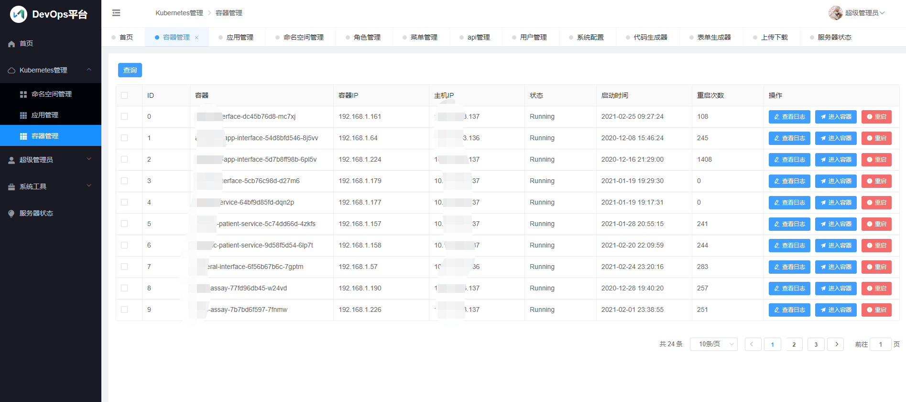

# 项目介绍
本项目基于[Gin-Vue-Admin](https://github.com/flipped-aurora/gin-vue-admin)开源前后端框架开发(特别感谢!)，在此基础上做了大量精简，力图实现管理Kubernetes、应用监控和发布回滚等功能。

## 技术栈
- 前端框架：[Element-ui](https://github.com/ElemeFE/element)、[Vue](https://cn.vuejs.org/)
- 后台框架：[Gin](https://github.com/gin-gonic/gin) 

# 部署使用

```
- node版本 > v8.6.0
- golang版本 >= v1.14
- IDE推荐：Goland
```

## 启动Server端
### 修改配置文件
```bash
# 克隆项目
git clone git@github.com:openstack-test/gin-vue-devops.git

# 修改server/config.yaml文件. 其中mysql数据库需要先创建好
# mysql configuration
mysql:
  path: '127.0.0.1:3306'
  config: 'charset=utf8mb4&parseTime=True&loc=Local'
  db-name: 'gin-vue-devops'
  username: 'root'
  password: 'Aa@6447985'
  max-idle-conns: 10
  max-open-conns: 100
  log-mode: false

# redis configuration
redis:
  db: 0
  addr: '127.0.0.1:6379'
  password: ''

# 将kubeconfig文件放在server/kubeconfig目录下,文件名为.kube-staging
```

### 初始化数据库
- Windows用户

在server目录下，打开终端执行
```bash
./initdb.bat
```

- Linux/Mac用户

```bash
# 在server目录下,先构建gva终端工具
make gva
# 使用gva初始化数据, 如果不使用make initdb, 使用./gva initdb也可以
make initdb
```

使用 goland等编辑工具，打开server目录

```bash

# 进入server目录安装go依赖包
go list (go mod tidy)

# 编译
go build -o gin-vue-devops

# 启动服务
./gin-vue-devops
```

## 启动Web端

```bash
# 进入web前端目录
cd web

# 安装依赖
npm install --registry=https://registry.npm.taobao.org

# 启动前端服务,会自动打开浏览器页面
npm run serve

# 发布打包（只在正式上线时使用）,将生成的dist目录下的所有文件拷贝到nginx目录下
npm run build
```

## Swagger自动化API文档

### 安装 swagger
````
go get -u github.com/swaggo/swag/cmd/swag
````

### 生成API文档

````
cd server
swag init
````
执行上面的命令后，server目录下会出现docs文件夹，登录http://localhost:8888/swagger/index.html, 即可查看swagger文档

#  项目架构

## 技术选型

- 前端：用基于`vue`的`Element-UI`构建基础页面。
- 后端：用`Gin`快速搭建基础restful风格API，`Gin`是一个go语言编写的Web框架。
- 数据库：采用`MySql`(5.6.44)版本，使用`gorm`实现对数据库的基本操作。
- 缓存：使用`Redis`实现记录当前活跃用户的`jwt`令牌并实现多点登录限制。
- API文档：使用`Swagger`构建自动化文档。
- 配置文件：使用`viper`实现`yaml`格式的配置文件。
- 日志：使用`zap`实现日志记录。

## 系统架构图
后端


前端


功能预览


## 目录结构

```
    ├─server  	     （后端文件夹）
    │  ├─api            （API）
    |  ├─cmd            （数据库表初始化工具）
    │  ├─config         （配置相关）
    │  ├─core  	        （启动相关）
    │  ├─docs  	        （swagger文档目录）
    │  ├─global         （全局对象）
    │  ├─initialiaze    （gorm、log、route、validator等相关初始化）
    │  ├─middleware     （中间件）
    │  ├─model          （结构体层）
    │  ├─resource       （资源）
    │  ├─router         （路由）
    │  ├─service         (服务)
    │  └─utils	        （公共功能）
    └─web            （前端文件夹）
        ├─public        （发布模板）
        └─src           （源码包）
            ├─api       （向后台发送ajax的封装层）
            ├─assets	 （静态文件）
            ├─components（组件）
            ├─router	 （前端路由）
            ├─store     （vuex 状态管理仓）
            ├─style     （通用样式文件）
            ├─utils     （前端工具库）
            └─view      （前端页面）

```

## 主要功能

- 权限管理：基于`jwt`和`casbin`实现的权限管理 
- 角色管理：创建权限控制的主要对象，可以给角色分配不同api权限和菜单权限。
- 菜单管理：实现用户动态菜单配置，实现不同角色不同菜单。
- api管理：不同用户可调用的api接口的权限不同。
- 表单生成器：表单生成器借助 [@form-generator](https://github.com/JakHuang/form-generator)。
- 代码生成器：后台基础逻辑以及简单curd的代码生成器。
- Kubernetes管理：包括NameSpace、Deployment、Pod容器等资源对象。

## 计划任务

- [ ] 完善Kubernetes资源对象管理
- [ ] 应用创建部署、回滚
- [ ] 其他


